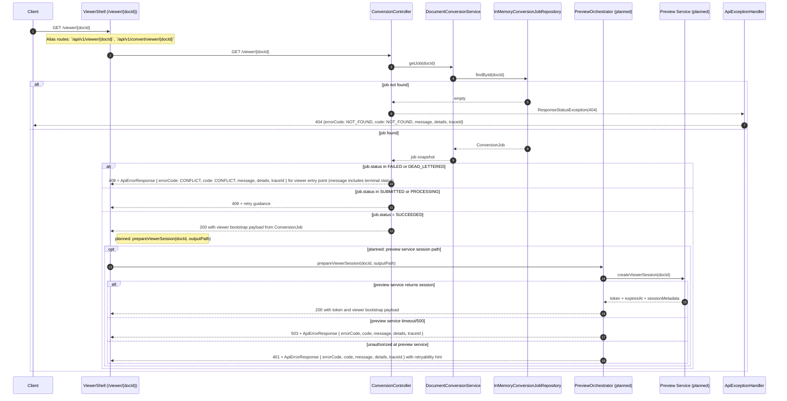

# Preview Flow UML (component + sequence)

This document tracks the `GET /viewer/{docId}` contract currently implemented in the backend (with aliases `/api/v1/viewer/{docId}` and `/api/v1/convert/viewer/{docId}`) and the planned S2S orchestration extension.

## Component diagram

```mermaid
flowchart LR
  Client[Client / Viewer Shell]
  Viewer[Viewer API / /viewer/{docId}, /api/v1/viewer/{docId}, /api/v1/convert/viewer/{docId}]
  Controller[ConversionController]
  Service[DocumentConversionService]
  Repo[InMemoryConversionJobRepository]
  PreviewCtl[PreviewOrchestrator (planned)]
  PreviewService[Preview Service / S2S API (planned)]
  Artifact[(Artifact Store / path for output)]
  AuthN[(AuthN/AuthZ + audit + trace)]

  Client --> Viewer
  Viewer --> Controller
  Viewer --> AuthN
  Controller --> Service
  Service --> Repo
  Repo --> PreviewCtl
  PreviewCtl --> PreviewService
  PreviewService --> Artifact

  classDef planned stroke-dasharray: 4 4,stroke:#808080,color:#808080;
  class PreviewCtl,PreviewService,AuthN planned;
```

## Sequence diagram



## Exception paths covered

- Missing job and conversion record (404).
- Job not ready for bootstrap (SUBMITTED/PROCESSING) or failed conversion result (FAILED).
- Failed conversion with explicit reason.
- `DEAD_LETTERED` shares the same 409 terminal path with clearer status message.
- Preview service timeout or authorization failure with traceable error path (planned extension).
- HWP/HWPX and manual policy path: preview path only allowed after successful exception policy resolution (planned extension).
