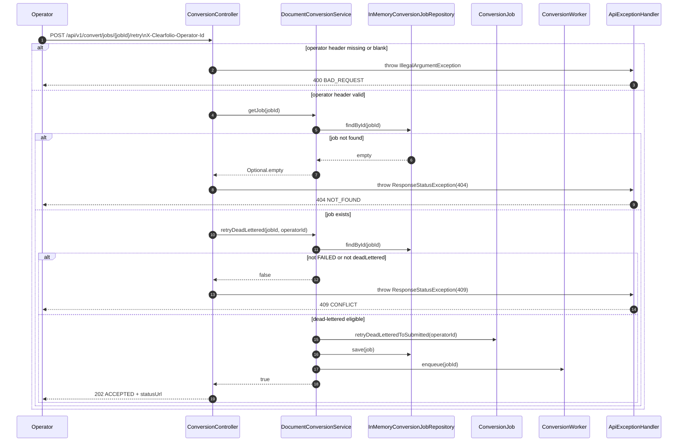
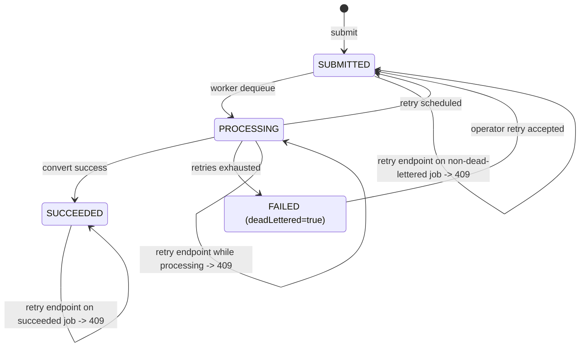

# Dead-Letter Retry Flow UML

This document covers operator-triggered retry behavior for
`POST /api/v1/convert/jobs/{jobId}/retry`.

## Sequence diagram

```mermaid
sequenceDiagram
  autonumber
  participant O as Operator
  participant Ctl as ConversionController
  participant Svc as DocumentConversionService
  participant Repo as InMemoryConversionJobRepository
  participant Job as ConversionJob
  participant W as ConversionWorker
  participant EH as ApiExceptionHandler

  O->>Ctl: POST /api/v1/convert/jobs/{jobId}/retry\nX-Clearfolio-Operator-Id

  alt operator header missing or blank
    Ctl->>EH: throw IllegalArgumentException
    EH-->>O: 400 BAD_REQUEST
  else operator header valid
    Ctl->>Svc: getJob(jobId)
    Svc->>Repo: findById(jobId)

    alt job not found
      Repo-->>Svc: empty
      Svc-->>Ctl: Optional.empty
      Ctl->>EH: throw ResponseStatusException(404)
      EH-->>O: 404 NOT_FOUND
    else job exists
      Ctl->>Svc: retryDeadLettered(jobId, operatorId)
      Svc->>Repo: findById(jobId)

      alt not FAILED or not deadLettered
        Svc-->>Ctl: false
        Ctl->>EH: throw ResponseStatusException(409)
        EH-->>O: 409 CONFLICT
      else dead-lettered eligible
        Svc->>Job: retryDeadLetteredToSubmitted(operatorId)
        Svc->>Repo: save(job)
        Svc->>W: enqueue(jobId)
        Svc-->>Ctl: true
        Ctl-->>O: 202 ACCEPTED + statusUrl
      end
    end
  end
```

## State transition diagram

```mermaid
stateDiagram-v2
  [*] --> SUBMITTED: submit
  SUBMITTED --> PROCESSING: worker dequeue
  PROCESSING --> SUCCEEDED: convert success
  PROCESSING --> SUBMITTED: retry scheduled
  PROCESSING --> FAILED_DLQ: retries exhausted

  state "FAILED (deadLettered=true)" as FAILED_DLQ

  FAILED_DLQ --> SUBMITTED: operator retry accepted
  SUBMITTED --> SUBMITTED: retry endpoint on non-dead-lettered job -> 409
  PROCESSING --> PROCESSING: retry endpoint while processing -> 409
  SUCCEEDED --> SUCCEEDED: retry endpoint on succeeded job -> 409
```
