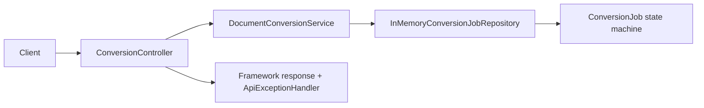
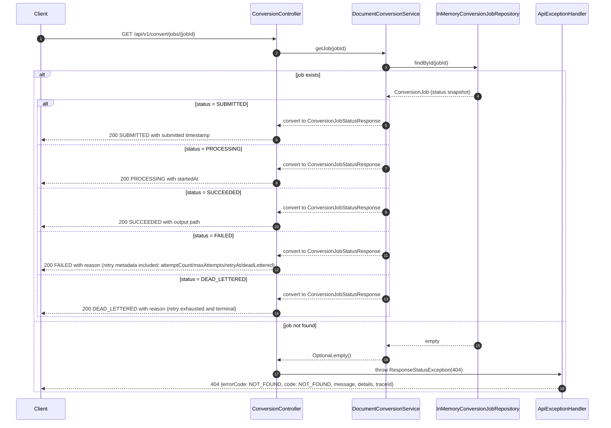

# Status Flow UML (component + sequence)

This document covers `GET /api/v1/convert/jobs/{jobId}` behavior for success and error branches.

## Component diagram

## Sequence diagram

## Exception paths covered

- 404 for missing `jobId`.
- Polling while conversion is running (PROCESSING/SUBMITTED).
- FAILED status includes stored failure message and retry metadata for UI rendering.
