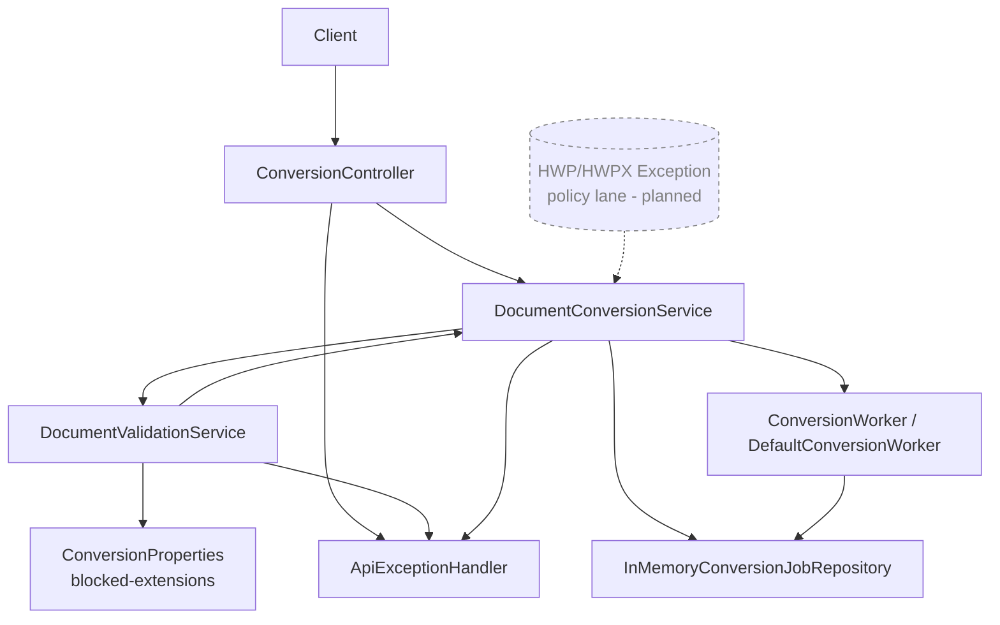

# Submit Flow UML (component + sequence)

This document covers the upload path for `POST /api/v1/convert/jobs`, including supported-success and exception branches.

## Component diagram



## Sequence diagram

```mermaid
sequenceDiagram
  autonumber
  participant C as Client
  participant Ctl as ConversionController
  participant Svc as DocumentConversionService
  participant V as DefaultDocumentValidationService
  participant P as ConversionProperties
  participant Repo as InMemoryConversionJobRepository
  participant W as ConversionWorker
  participant EH as ApiExceptionHandler

  C->>Ctl: POST /api/v1/convert/jobs (multipart)
  Ctl->>Svc: submit(file)
  Svc->>V: validateOrThrow(file)

  alt Empty/missing file
    V-->>Svc: IllegalArgumentException
    Svc-->>EH: map to BAD_REQUEST
    EH-->>C: 400 {errorCode: BAD_REQUEST, code: BAD_REQUEST}

  else Extension in blocked list (hwp or hwpx)
    V->>P: getBlockedExtensions()
    V-->>Svc: UnsupportedDocumentFormatException("hwp/hwpx")
    Svc-->>EH: handleUnsupported
    EH-->>C: 400 {errorCode: UNSUPPORTED_FORMAT, code: UNSUPPORTED_FORMAT, details.extension}
    Note right of V: Current behavior rejects by config only.
    Note right of EH: Planned lane: approved exceptions are raised to
    manual review queue before rerun.

  else Validation passes
    V-->>Svc: validation ok
    Svc-->>Svc: sha256(file stream)

    alt Hash calculation fails
      Svc-->>C: 500 InternalServerError
    else Hash calculated
      Svc->>Repo: findOrStoreByContentHash(job)
      Repo-->>Svc: canonical job id

      alt first submission of hash
        Svc->>W: enqueue(jobId)
      else duplicate hash
        Svc->>Svc: reuse canonical jobId
      end

      Svc-->>Ctl: jobId
      Ctl-->>C: 202 Accepted + jobId
    end
  end
```

## Exception paths covered

- Missing or empty file
- Empty/invalid file name extension
- HWP/HWPX blocked extension
- Hashing failure during submit (mapped to generic server error currently)
- Duplicate submission reused from canonical hash
