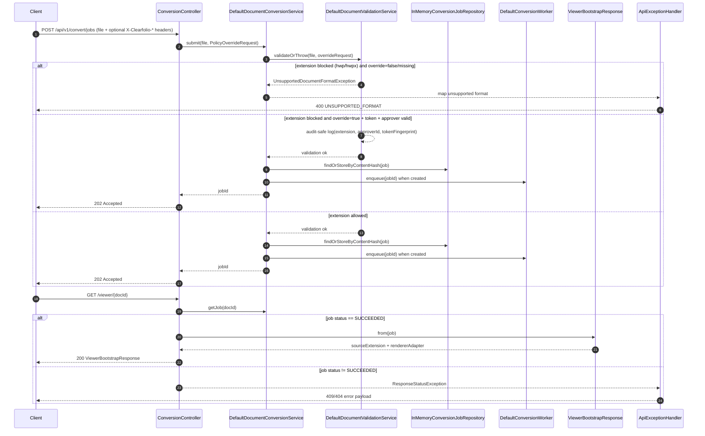

# Submit Policy-Exception + Adapter Selection Flow

This UML-style diagram documents the implemented MVP flow that combines:

- blocked-format policy exception lane on submit (`POST /api/v1/convert/jobs`), and
- deterministic renderer adapter metadata on viewer bootstrap (`GET /viewer/{docId}`).

## Sequence diagram

## Deterministic adapter baseline

- `pdf -> PDF_JS`
- `doc/docx -> DOCX_PREVIEW`
- `xls/xlsx/csv/tsv -> SHEET_ADAPTER`
- `ppt/pptx -> SLIDE_ADAPTER`
- `md/txt -> TEXT_ADAPTER`
- default -> `PDF_JS`
